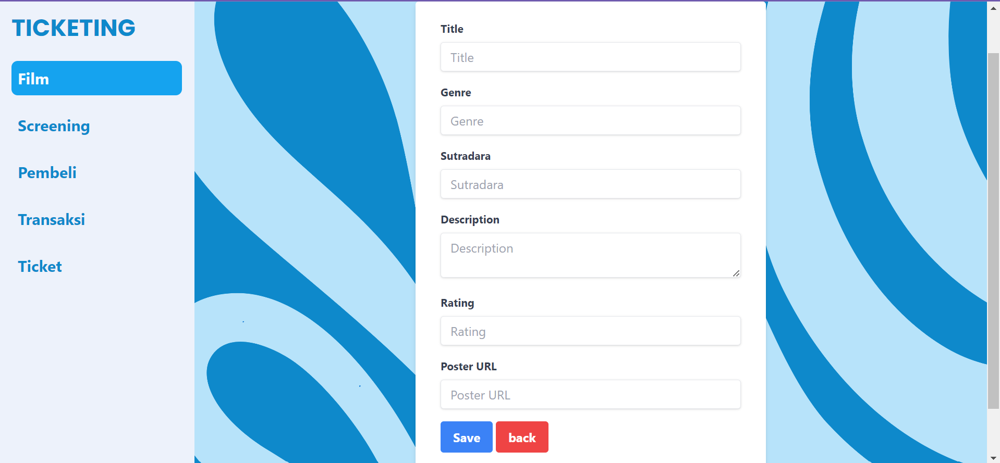

Berikut versi terbaru README Anda dengan penambahan teknologi yang digunakan beserta cara instal dan cara menjalankan project:

# PROJECT
Disini saya membuat sebuah project UTS Front End yaitu Kelola Ticketing dengan menggunakan library React JS, EXPRESS JS, React Router DOM untuk melakukan routing, AXIOS untuk melakukan fetching data dan menggunakan Tailwind CSS untuk memberikan responsive pada tampilan web.

## FEATURES
- Integrasi dengan Rest API untuk fetching data
- Style menggunakan Tailwind CSS

### TEKNOLOGI YANG DIGUNAKAN DALAM PEMBUATAN PROJECT :
- **React** - Library JavaScript untuk membuat user interface
- **Tailwind CSS** - Framework CSS berbasis utility-first
- **Axios** - Klien HTTP berbasis promise untuk melakukan permintaan API
- **React Router DOM** - Library untuk routing dalam aplikasi React, menyediakan cara untuk bernavigasi antara komponen atau halaman berbeda dalam aplikasi web
- **Express.js** - Framework back-end yang digunakan untuk membangun Rest API
- **GitHub Pages** - Layanan hosting statis yang digunakan untuk deployment project

## INSTALLATION
Berikut adalah langkah-langkah untuk menginstal dan menjalankan project ini di lokal Anda:

### Prasyarat
- Node.js (v12.x atau lebih baru)
- NPM (biasanya sudah terinstal bersama Node.js)

### Cara Instal
1. Clone repository dari GitHub:
   ```bash
   git clone https://github.com/troverint/uts-pajri-github.io.git
   ```

2. Arahkan ke direktori project:
   ```bash
   cd fe_ticket
   ```

3. Instal semua dependencies yang diperlukan:
   ```bash
   npm install
   ```

### Cara Menjalankan Project
1. Jalankan server development:
   ```bash
   npm start
   ```

2. Buka browser dan navigasikan ke `http://localhost:3000` untuk melihat project Anda berjalan.

### Cara Deploy
Untuk melakukan deploy project ke GitHub Pages, gunakan perintah berikut:
```bash
npm run deploy
```

## ROUTING AKSES MENU: 
- `/film` - Menampilkan daftar film
- `/screening` - Menampilkan jadwal screening film
- `/pembeli` - Menampilkan daftar pembeli
- `/transaksi` - Menampilkan daftar transaksi
- `/ticket` - Menampilkan daftar tiket

## SCREENSHOT
Berikut hasil screenshot dari tampilan yang telah dibuat:

1. **Halaman Awal** - Page film list:
   

2. **Halaman Screening** - Page screening list:
   

3. **Halaman Pembeli** - Page list pembeli:
   

4. **Halaman Transaksi** - Page list transaksi:
   

5. **Halaman Ticket** - Page list Ticket:
   

## SCREENSHOT FORM
Berikut hasil screenshot dari tampilan **Form** yang telah dibuat:

- Form add dari **Page Film List**:
  

# Terima kasih!