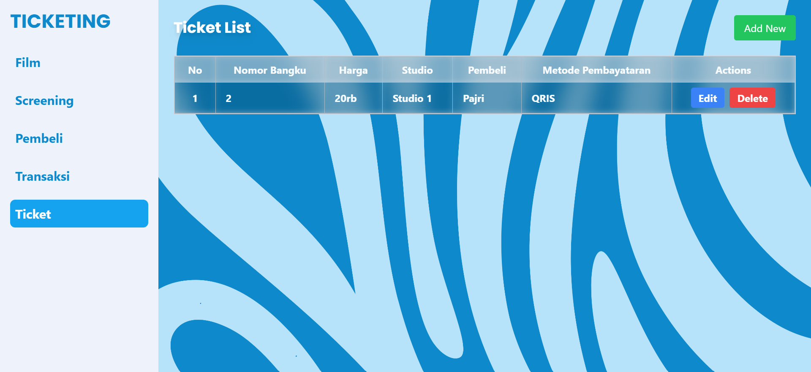

# PROJECT
Disini saya membuat sebuah project UTS Front End yaitu Kelola Ticketing dengan menggunakan library React JS, EXPRESS JS, React Router DOM untuk melakukan routing, AXIOS untuk melakukan fetching data dan menggunakan Tailwind CSS untuk memberikan responsive pada tampilan web.

## FEATURES
- Integrasi dengan Rest API untuk fetching data
- Style menggunakan tailwind

### TEKNOLOGI YANG DIGUNAKAN DALAM PEMBUATAN PROJECT :
- <b>React</b> - Library JavaScript untuk membuat user interface
- <b>Tailwind CSS</b> - Framework CSS berbasis utility-first
- <b>Axios</b> - Klien HTTP berbasis promise untuk melakukan permintaan API
- <b>React Router DOM</b> - Library untuk routing dalam aplikasi React, menyediakan cara untuk bernavigasi antara komponen atau halaman berbeda dalam aplikasi web

## ROUTING AKSES MENU: 
- /film
- /screening
- /pembeli
- /transaksi
- /ticket

## SCREENSHOT
Berikut hasil screenshot dari tampilan yang telah dibuat: 

1. <b>Halaman Awal</b> - Page film list :

2. <b>Halaman Screening</b> - Page screening list :

3. <b>Halaman Pembeli</b> - Page list pembeli :

4. <b>Halaman Transaksi</b> - Page list transaksi :

5. <b>Halaman Ticket</b> - Page list Ticket :

## SCREENSHOT FORM
Berikut hasil screenshot dari tampilan <b>Form</b> yang telah dibuat: 

- Form add dari <b>Page Film List</b> 

# ARIGATOU GOZAIMASU
